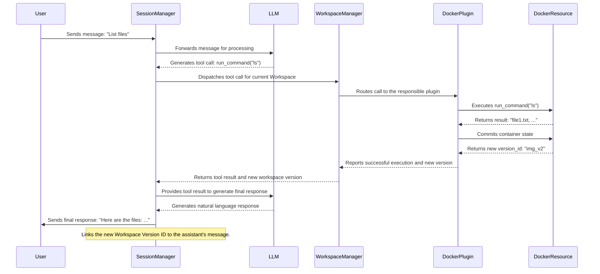

# Domarkx Architecture Specification

## 1. Core Principles

The architecture of `domarkx` is guided by a set of core principles that ensure a robust, flexible, and maintainable system. These principles inform the design of every component and interaction within the system.

### 1.1. Separation of Concerns

The system strictly separates the concept of a **Session** (the conversational history) from a **Workspace** (the execution environment).

*   **Sessions** are lightweight, serializable records of dialogue. They are concerned only with the "what" of the conversation.
*   **Workspaces** are stateful, versioned containers for resources. They are concerned only with the "how" and "where" of execution.

This separation allows for independent management, scaling, and evolution of the conversational and execution aspects of the system.

### 1.2. Traceability and Reproducibility

Every action that modifies the state of the environment must be captured and linked to the conversational turn that caused it.

*   Each assistant message is immutably linked to the precise version of the workspace *after* its associated tool calls have been executed.
*   This creates a complete, auditable chain of causality, making it possible to deterministically reproduce the state of the workspace at any point in the conversation.

### 1.3. Extensibility through Plugins

The system is designed to be highly extensible. All environment-specific logic, including state management and versioning, is handled by a well-defined **Plugin** architecture.

*   Workspaces are composed of **Resources**, and each resource type is managed by a dedicated **Plugin**.
*   This allows developers to easily add new capabilities—such as version-controlled file systems, databases, or cloud environments—without modifying the core session management logic.

## 2. Core Concepts

The `domarkx` architecture is built upon four fundamental concepts that together provide a powerful framework for creating and managing interactive, stateful AI sessions.

### 2.1. Session

A **Session** is the most basic unit of conversation. It is a lightweight, ordered list of messages between a user and an assistant.

*   **Purpose:** To capture the dialogue and intent of an interaction.
*   **Characteristics:**
    *   **Stateless (in terms of environment):** A Session contains no information about the execution environment, file systems, or external state.
    *   **Serializable:** Sessions can be easily saved, loaded, and transferred.
    *   **Independent:** A Session is a self-contained object that can be associated with different workspaces over time.

### 2.2. Workspace

A **Workspace** is a logical container for the stateful environment in which a session is executed.

*   **Purpose:** To manage the resources, tools, and state that an AI assistant can interact with.
*   **Characteristics:**
    *   **Stateful:** A Workspace holds the current state of all its resources.
    *   **Versioned:** The state of a Workspace is not monolithic. Instead, its "version" is an aggregation of the individual versions of all the resources it contains. This allows for fine-grained state tracking.
    *   **Composable:** A Workspace is composed of one or more Resources.

### 2.3. Resource

A **Resource** is a concrete component within a Workspace that provides a specific set of capabilities. It is the "thing" that the AI assistant's tools actually interact with.

*   **Purpose:** To represent a specific piece of the execution environment.
*   **Examples:**
    *   A Docker container providing a sandboxed command-line environment.
    *   A version-controlled Git repository for source code management.
    *   A connection to a SQL database.
*   **Characteristics:**
    *   **Versioned:** Each Resource is responsible for its own versioning scheme (e.g., Docker image IDs, Git commit hashes).
    *   **Tool Provider:** A Resource exposes a set of tools (e.g., `run_command`, `commit_code`) that can be called by the AI assistant.

### 2.4. Plugin

A **Plugin** is the implementation of a specific resource type. It contains the logic for managing the lifecycle, state, and versioning of its corresponding Resources.

*   **Purpose:** To provide a standardized way to integrate new types of resources into the `domarkx` ecosystem.
*   **Responsibilities:**
    *   **Resource Lifecycle:** Creating, loading, and tearing down resource instances.
    *   **Tool Execution:** Implementing the logic for the tools that the resource provides.
    *   **Versioning:** Defining and managing the versioning scheme for the resource (e.g., calling `docker commit`).
    *   **Interface:** Adhering to the Plugin Protocol defined in this specification.

## 3. Architecture Deep Dive

This section details the interactions between the core concepts and illustrates the end-to-end execution flow of a conversational turn.

### 3.1. Component Interaction

The system is orchestrated by two central managers:

*   **`SessionManager`:** A global service responsible for the lifecycle of all Sessions. It handles creation, retrieval, and storage of conversational histories.
*   **`WorkspaceManager`:** A global service that manages Workspaces and the Plugins that power them. It is responsible for routing tool calls to the appropriate Plugin and coordinating the versioning of Resources.

The relationship between the components can be visualized as follows:

```
+------------------+       +--------------------+       +----------------------+
| SessionManager   | ----> | Session            | ----> | Message              |
| (Global)         |       | (e.g., chat_abc)   |       | (workspace_version)  |
+------------------+       +--------------------+       +-----------+----------+
                                                                     |
                                                                     | Links to
                                                                     |
+------------------+       +--------------------+       +-----------+----------+
| WorkspaceManager | ----> | Workspace          | ----> | Resource             |
| (Global)         |       | (e.g., project_xyz)|       | (e.g., docker_123)   |
+------------------+       +--------------------+       | (version_id)         |
      |                                                +-----------+----------+
      | Loads                                                      | Managed by
      |                                                            |
      v                                                            v
+------------------+                                   +-----------+----------+
| Plugin           | <----------------------------------+ Plugin               |
| (e.g., Docker)   |                                    | (e.g., DockerPlugin) |
+------------------+                                    +----------------------+
```

### 3.2. Execution Flow (Sequence Diagram)

The following sequence diagram illustrates the process of a single conversational turn that involves a tool call.



## 4. Plugin Protocol Specification

The Plugin Protocol is a contract that all plugins must adhere to. It ensures that the `WorkspaceManager` can interact with any resource in a standardized way. The protocol is defined as an abstract base class (`Plugin`) that all plugin implementations must inherit from.

### 4.1. `Plugin` Abstract Base Class

```python
from domarkx.data.models import Resource

class Plugin(abc.ABC):
    """Abstract base class for a domarkx plugin."""

    @property
    @abc.abstractmethod
    def type(self) -> str:
        """The type of the resource this plugin manages (e.g., 'docker_sandbox')."""
        raise NotImplementedError

    @abc.abstractmethod
    def create_resource(self, config: dict[str, Any]) -> Resource:
        """
        Create a new resource instance based on the provided configuration.
        This method is called when a workspace is first created or when a new
        resource is added.

        Args:
            config (dict): The resource-specific configuration, typically parsed
                           from a Markdown `workspace-config` block.

        Returns:
            Resource: A Pydantic model representing the newly created resource.
        """
        raise NotImplementedError

    @abc.abstractmethod
    def execute_tool(self, resource_id: str, tool_name: str, **kwargs: Any) -> Any:
        """
        Execute a tool on a specific resource instance.

        Args:
            resource_id (str): The unique identifier of the resource.
            tool_name (str): The name of the tool to execute.
            **kwargs: The arguments for the tool.

        Returns:
            Any: The result of the tool execution, which must be serializable.
        """
        raise NotImplementedError

    @abc.abstractmethod
    def get_version(self, resource_id: str) -> str:
        """
        Get the current version identifier of a resource.

        Args:
            resource_id (str): The unique identifier of the resource.

        Returns:
            str: The current version identifier (e.g., a Docker image ID).
        """
        raise NotImplementedError

    @abc.abstractmethod
    def commit_version(self, resource_id: str) -> str:
        """
        Create a new, immutable version of a resource's state. This is the core
        of the versioning system.

        Args:
            resource_id (str): The unique identifier of the resource.

        Returns:
            str: The new version identifier for the committed state.
        """
        raise NotImplementedError

    @abc.abstractmethod
    def load_version(self, resource_id: str, version_id: str) -> None:
        """
        Restore a resource to a specific, previously committed version.

        Args:
            resource_id (str): The unique identifier of the resource.
            version_id (str): The version to load.
        """
        raise NotImplementedError
```

## 5. Markdown Serialization

The Markdown file is the primary user-facing artifact for defining a `domarkx` project. It serves as a human-readable and version-control-friendly format for bootstrapping a Session and its associated Workspace.

### 5.1. Mapping to Core Concepts

The `domarkx project import` command uses the `MarkdownParser` to transform the document into the core architectural objects:

*   **Conversation History (`Session`):** All standard Markdown content, such as headings (H2 for roles), paragraphs, and code blocks (that are not `workspace-config`), are parsed into a sequence of `Message` objects, forming the initial state of the `Session`.

*   **Workspace and Resources:** A special YAML code block with the language identifier `workspace-config` is used to define the initial state of the `Workspace` and its `Resources`.

### 5.2. `workspace-config` Block

This block contains a YAML object that defines the resources to be created in the workspace.

*   The root key must be `resources`, which is a list of resource configuration objects.
*   Each object in the list must have a `type` key, which corresponds to the type of a registered `Plugin` (e.g., `docker_sandbox`).
*   The rest of the keys in the object are passed as the `config` dictionary to the `create_resource` method of the corresponding plugin.

#### Example

The following Markdown example demonstrates how to define a session and a workspace with a single `docker_sandbox` resource.

```markdown
---
title: My Project
---

## user

Can you set up a Python environment for me?

## assistant

Of course. I will use a Docker container with the latest Ubuntu image.

```workspace-config
resources:
  - type: docker_sandbox
    image: "ubuntu:latest"
    # Additional plugin-specific config would go here
```
